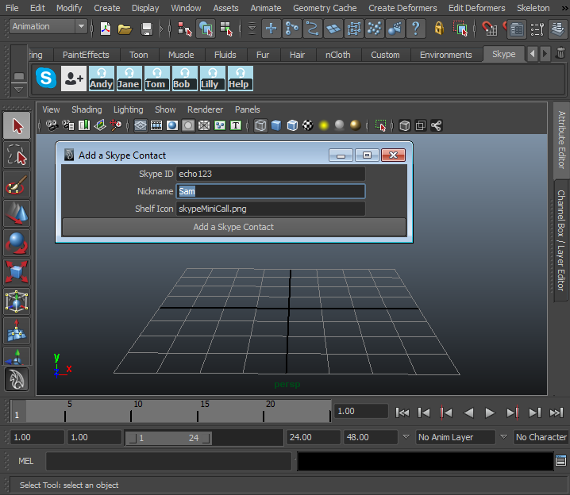
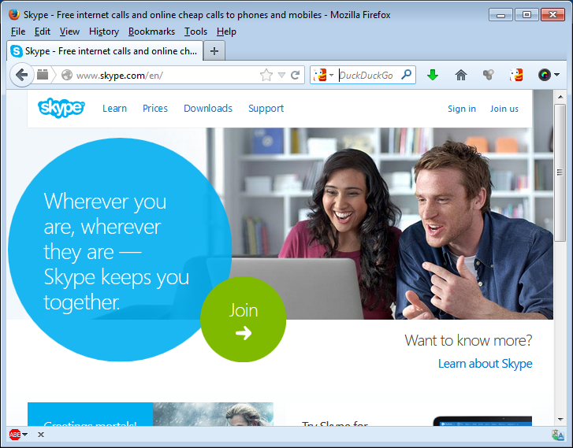
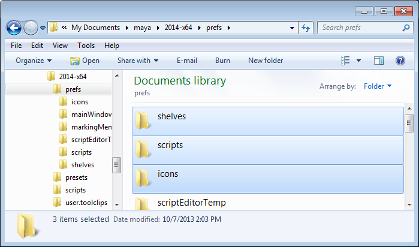
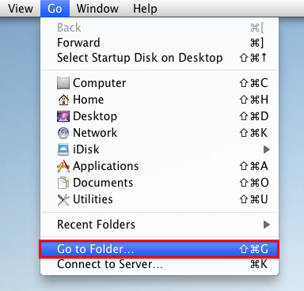
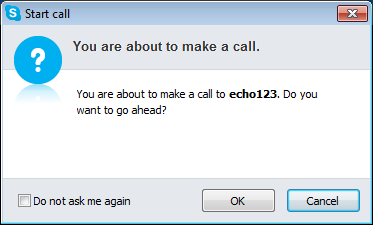
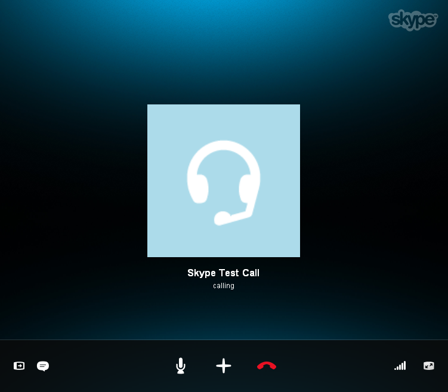
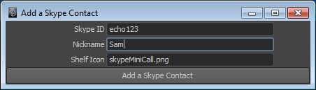

# Skype for Maya #
**Version 1** Released October 11, 2013  
by Andrew Hazelden

## Overview ##
I would like to present a Maya module that makes it easy to call a Skype user from inside Maya using a custom Skype shelf.

This module was created after[ I made a joke among my friends about the new features Autodesk could add to Maya 2015](http://www.andrewhazelden.com/blog/2013/10/maya-2015-new-feature-suggestions/). One of them said "How about adding Skype to the Maya viewport?". Well, I thought about that and said a few minutes later, "why not!". This is the resulting script.

**Note:** The free program Skype is required to use this script.

## Download ##

The Skype for Maya module is a free download.

You can download the latest version of the script here:   
[http://www.andrewhazelden.com/blog/2013/11/skype-for-maya](http://www.andrewhazelden.com/blog/2013/11/skype-for-maya)

## Installation ##

**Step 1.**  [Download Skype](http://www.skype.com/) and install it on your system.

**Step 2.**  Open your Maya prefs folder. 

On Windows the Maya prefs folder is located at one of the following locations:

    Documents\maya\2010-x64\prefs
    Documents\maya\2011-x64\prefs
    Documents\maya\2012-x64\prefs
    Documents\maya\2013-x64\prefs
    Documents\maya\2014-x64\prefs

On Mac OS X the Maya prefs folder is located at one of the following locations:

    ~/Library/Preferences/Autodesk/maya/2011-x64/prefs/
    ~/Library/Preferences/Autodesk/maya/2012-x64/prefs/
    ~/Library/Preferences/Autodesk/maya/2013-x64/prefs/
    ~/Library/Preferences/Autodesk/maya/2013.5-x64/prefs/
    ~/Library/Preferences/Autodesk/maya/2014-x64/prefs/

If you are using Mac OS X Lion or Mountain Lion you can open the hidden ~/library folder by switching to the Finder. From the "Go" menu select, "Go to Folder..." or press the hotkey Shift-Command-G.

Paste in one of the Maya prefs folder paths from the list above and hit "go".

**Step 3.**
Install the Skype for Maya supporting files.   

If you are running Maya 2011-2014 use the resources from the **Maya 2011+ Files** folder. If you are using Maya 2010 use the resources from the **Maya 2010 Files** folder.

- Copy the Skype for Maya Shelf file `shelf_Skype.mel` to the Maya prefs **shelves** folder.   
- Copy the Skype for Maya icons to the Maya prefs **icons** folder.  
- Copy the Skype for Maya scripts to the Maya prefs **scripts** folder.   

**Step 4.** Start Maya. If the **Skype for Maya** file are correctly installed a new Skype shelf tab will appear.  

Click the first Skype Logo  icon in the shelf to place a Skype "test call".
At this point you should see a dialog letting you know Skype is going to call the user "echo123" which is the SkypeID for the Skype Test call service. 

**Note:** If you plan on using the Skype shelf tools frequently you might want to enable the "Do not ask me again" checkbox to save time.

Skype will switch to the foreground at this point and a connection will be made to the skype call test service. If you hear your voice played back to you after the message, Skype is working correctly.

* * *

To add a new contact to the Skype for Maya shelf, click the  AddCall icon that looks like a person next to a plus sign. A new window labelled "Add a Skype contact" will open.

Start by entering your contact's **Skype ID**. For example **echo123** is the Skype ID for the Skype call test service.

Then type in a **nickname** for the person. This nickname will be written as a label on the person's Skype shelf icon. 

**Note:** If you leave the nickname field blank the Skype contact will have their avatar image displayed without any labels or overlays added over the shelf button.

The **Shelf Icon** field lets you customize the avatar icon used for the person's shelf button. By default an  icon  named "skypeMiniCall.png" is used. 

You are free to use any icon you want for each of your Skype contacts. In order to load a custom avatar image you need to copy your custom icons into the Maya prefs > icons folder. Also, make sure to scale the icon down to a 32x32 pixel size and save it as a .PNG formatted image.

***

## Calling Skype from Maya Python ##

It is also possible to use the Skype for Maya "openSkypeCall" feature from your own Python scripts:

    import skypeCall  
    reload(skypeCall)  
    skypeCall.openSkypeCall('echo123')  

***
Cheers,  
Andrew Hazelden

eMail: [andrew@andrewhazelden.com](mailto:andrew@andrewhazelden.com)   
Blog: [http://www.andrewhazelden.com](http://www.andrewhazelden.com)  

